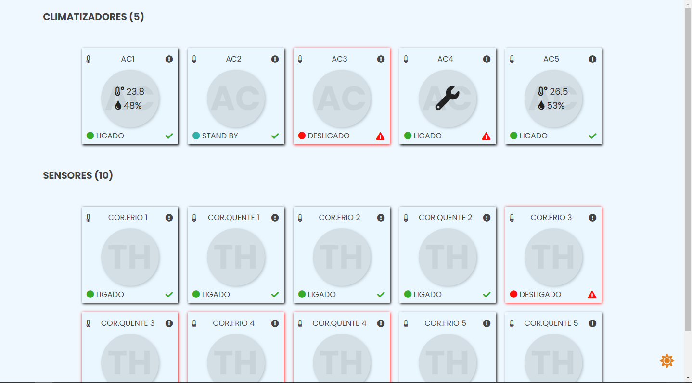
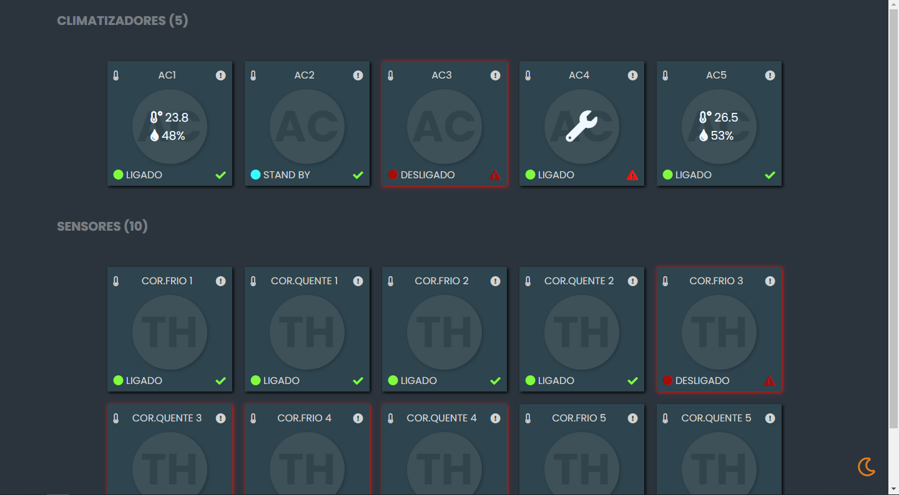
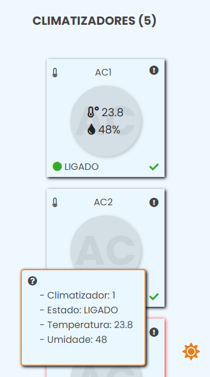
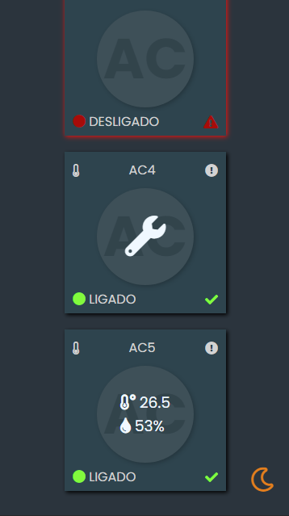
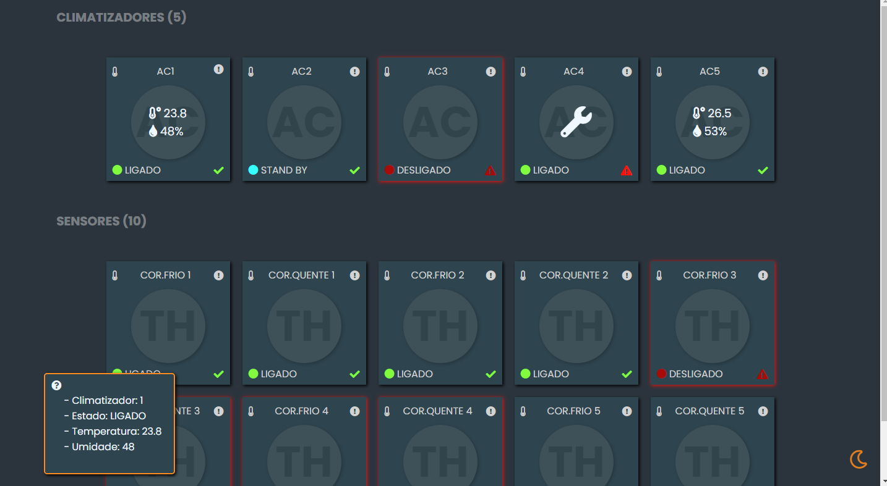
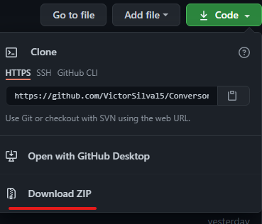

# CLIMATIZADORES

Esse projeto foi produzido com intuito de prática e aprendizado. Foi utilizado uma API que captura informações de climatizadores em formato JSON (acesse [aqui](https://climatizadores-json.vercel.app/)), e através de funções assíncronas esses valores são obtidos e renderizados na página HTML de forma estilizada. A página exibe apenas as informações dos climatizadores, sem possibilidade de controle pela plataforma. Com a página, é possível analisar se os climatizadores estão funcionando corretamente, ou se precisam de manutenção, além de mostrar quais estão ligados / desligados ou stand by. Essa versão contém opção de temas light ou dark, e deixei responsivo para que se adapte em diferentes formatos de telas.

<h2>Status do Projeto</h2>

<h4> 🚧 🚀 Em construção...  🚧 </h4>

<h2>Pré-requisitos</h2>

Para executar essa projeto basta abrir a página index.html no seu navegador (Chrome, Edge, FireFox). Se quiser modificar o código será necessário um editor de códigos de sua preferência. Recomendo usar o <a href="https://code.visualstudio.com/download" alt="VS Code">Visual Studio Code</a>.

<h2>Demonstração</h2>

- Tema Light:

- Tema Dark:

- Mobile (responsivo):

- Quando o mouse fica em cima do ícone de informação em um dos cards do climatizador, é exibido uma caixa com os dados do climatizador, listados no canto inferior esquerdo da tela. Tal elemento fica fixo na tela e desaparece assim que o mouse sai de cima do ícone

<h2>Como usar</h2>

Esse projeto está hospedado na vercel, um site que possibilita a hospedagem de páginas HTML entre outras tecnologias de forma gratuita e acessível (Clique [aqui](https://climatizadores-page-web.vercel.app/) para abrir a página em seu navegador). Se você quiser testar em sua máquina basta baixar ele através do botão CODE em verde do lado do repositório e em seguida escolher Download ZIP que os arquivos iram para sua área de download.Após extrair a pasta do projeto para sua área de trabalho basta entrar na pasta CLIMATIZADORES e dar um duplo clique em cima do arquivo index.html que ele será aberto na seu navegador.

### 🛠 Tecnologias

As seguintes ferramentas foram usadas na construção do projeto:

- [HTML](https://developer.mozilla.org/pt-BR/docs/Web/HTML)

- [CSS](https://developer.mozilla.org/pt-BR/docs/Web/CSS)

- [JavaScript](https://developer.mozilla.org/pt-BR/docs/Web/JavaScript)

- [Google Fonts Poppins](https://fonts.google.com/specimen/Poppins?query=Popp)

- [Font Awesome Icons](https://fontawesome.com)

## 💪 Como contribuir para o projeto

1. Faça um **fork** do projeto.

2. Crie uma nova branch com as suas alterações: `git checkout -b my-feature`

3. Salve as alterações e crie uma mensagem de commit contando o que você fez: `git commit -m "feature: My new feature"`

4. Envie as suas alterações: `git push origin my-feature`

> Caso tenha alguma dúvida confira este [guia de como contribuir no GitHub](./CONTRIBUTING.md)

---

### Autor

<b>Victor Hugo</b>🚀

## 📝 Licença

Este projeto esta sobe a licença [MIT](./LICENSE).

Feito com ❤️ por Victor Hugo da Silva 👋🏽 Entre em contato!

---

